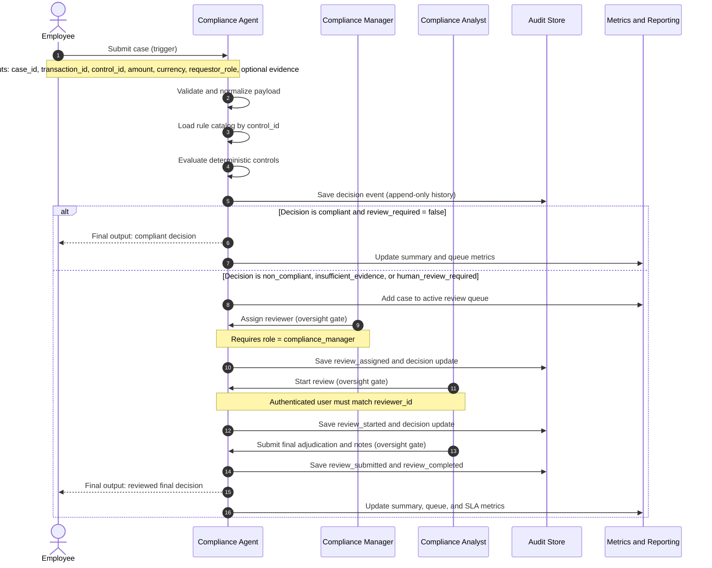

# Workflow Swimlane: Gifts and Hospitality Compliance MVP

## Swimlane Diagram

## Decision Points Requiring Human Oversight

1. Assignment gate: only a compliance manager can assign a reviewer.
2. Start-review gate: only the authenticated assigned reviewer can start the case.
3. Final adjudication gate: reviewer determines final decision and outcome with notes.
4. Exception-handling gate: ambiguous evidence or policy-scope mismatches route to human review.

## Dependencies

### Data Sources

- Case intake payload from request or expense workflow
- Rule catalogs in data/rules
- Approval evidence and receipt evidence when present
- Persisted decision and review records for queue and metrics

### Permissions

- Identity context headers: X-User-Id and X-User-Role
- Allowed roles: employee, compliance_analyst, compliance_manager, auditor
- Manager-only assignment and reviewer identity matching for start and submit actions

### System Access

- API endpoints for evaluate, review lifecycle, queue, metrics, and summary
- SQLite availability for current state and append-only history
- Rule catalog read access for control resolution
