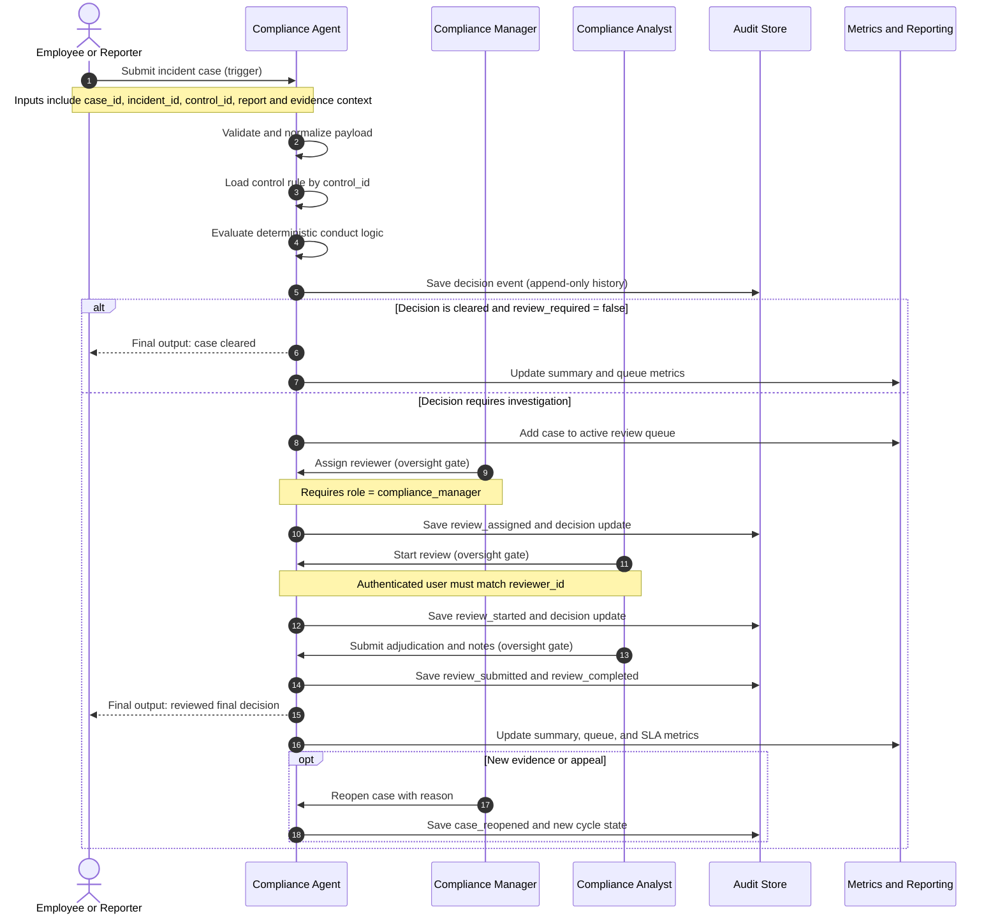

# Workflow Swimlane: Employee Conduct Compliance MVP

## Swimlane Diagram

## Decision Points Requiring Human Oversight

1. Assignment gate: only a compliance manager can assign a reviewer.
2. Start-review gate: only the authenticated assigned reviewer can start the case.
3. Final adjudication gate: reviewer determines final decision and outcome with notes.
4. Reopen gate: only authorized managers can reopen completed investigations.

## Dependencies

### Data Sources

- Incident intake payload and structured evidence fields
- Rule catalogs in data/rules
- Persisted decision and review records for queue and metrics

### Permissions

- Bearer token identity with role claims
- Allowed roles: employee, compliance_analyst, compliance_manager, auditor
- Manager-only assignment and reopen actions

### System Access

- API endpoints for evaluate, review lifecycle, queue, metrics, and summary
- SQLite availability for current state and append-only history
- Rule catalog read access for control resolution
